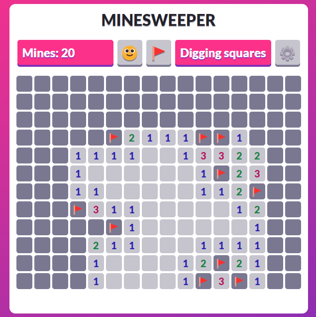

# Minesweeper
This is just your typical minesweeper made in React, including a resizable board and sound effects. Press F or click the flag button to start placing flags and press the face (like in Microsoft's minesweeper) to restart.

